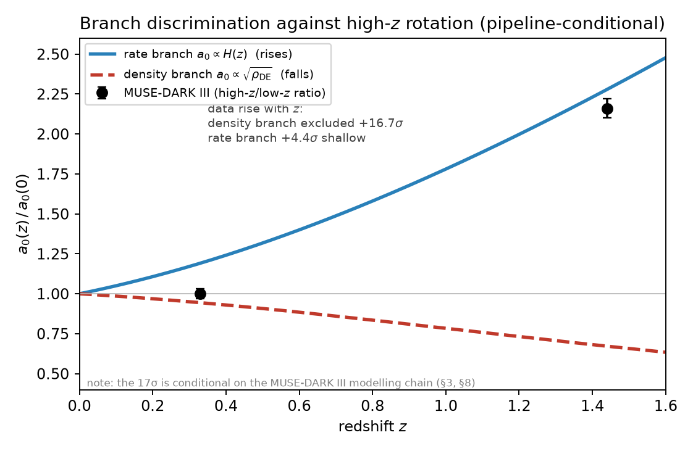
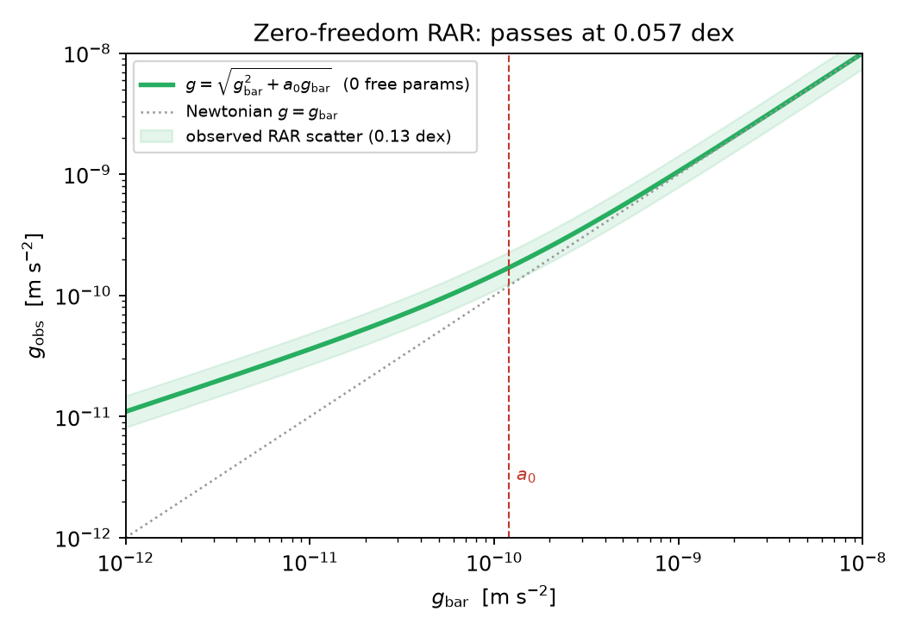

# The Galactic Face of the Entropy Clock: MOND as a Rate-Branch Acceleration Scale a₀ ∝ H(z)

**Stilian Pandev** ([ORCID: 0009-0005-8153-071X](https://orcid.org/0009-0005-8153-071X))

*Paper VIII of the Unified Structural-Entropy Cosmogenesis (USC) program — the galactic face.*

## Abstract

The MOND acceleration scale a₀ ≈ 1.2 × 10⁻¹⁰ m s⁻² sits, coincidentally, at cH₀/2π. We ask whether this is
a coincidence or the galactic readout of the same horizon-entropy clock that, in the USC program, drives
dark energy (dusk) and matter genesis (dawn). Two cosmological completions of the coincidence are possible:
a **density branch** a₀ ∝ $\sqrt{\rho_{\rm DE}}$ (falling with redshift), realized by the APDM superfluid, and a **rate
branch** a₀ ∝ H(z) (rising), realized by horizon-entropic / emergent gravity. This rate-vs-density
discrimination is not new — it was posed by @Limbach:2008aa (2008), who reached the marginally *opposite*
(density-favoured) verdict. Against the MUSE-DARK III measurement a₀(z) = (1.00 ± 0.04) + (1.59 ± 0.11)z
(ratio 2.16 ± 0.06 over z = 0.33 → 1.44), the density branch is **excluded at +16.7σ** (from matching the MUSE-DARK III fit) — it predicts
a *fall*, the data *rise*: a **wrong-sign** miss that is robust to the modeling chain and therefore fatal.
The rate branch matches the *sign* but is **amplitude-short at +4.4σ** — an offset that, unlike a sign
error, is absorbable into the same modeling systematics; the rate branch is thus *disfavoured but not
sign-excluded*, not a clean survivor. We are explicit that these two verdicts are held to different
standards *by design* — sign is modeling-robust, amplitude is not. We flag prominently that this significance is **conditional on the MUSE modeling
chain**: the rise is not merely unconfirmed but *absent — indeed reversed* (β ≈ −0.38) in the raw released
kinematics, which remains an open question. We then locate the surviving branch:
we derive that the ECCG dark-sector scalar is too short-range by 10³³ to carry MOND, and a gated-Verlinde elastic
MOND is excluded inside USC at 19–27σ (from matching the same data); the unique survivor is a **KMS-tilt modified inertia** whose
zero-freedom interpolation passes the RAR at 0.057 dex (again a match to the empirical relation). A worldline influence-functional calculation
derives the acceleration-selective coupling structure and a closed-form kernel (a/4π)cot(πa/κ) in which the
conjectured Green-function 4π genuinely appears (derived in a proxy model), but not yet the full a₀ coefficient,
which remains open. The coefficient-independent, pre-registered prediction is a₀(z) ∝ H(z) with **no saturation gate** —
MOND *strengthens* at high z (a₀(3)/a₀(0) ≈ 4.5 while Ω_DE(z=3) ≈ 3%) — falsifiable by JWST high-z rotators,
though existing declining high-z rotation curves already disfavour a strongly rising a₀ [@Milgrom:2017hpv]:
the central tension this branch must survive.

**Keywords —** modified Newtonian dynamics; galaxy rotation curves; dark energy; emergent gravity; radial acceleration relation.

---

## 1. Introduction

Milgrom's modified dynamics (MOND) [@Milgrom:1983ca; @Famaey:2011kh] organizes an enormous body of galactic
phenomenology — the baryonic
Tully–Fisher relation, the radial acceleration relation (RAR), the mass-discrepancy–acceleration relation —
around a single acceleration scale a₀ ≈ 1.2 × 10⁻¹⁰ m s⁻². Below a₀ the dynamics depart from Newton;
above it they return. The empirical tightness of the RAR (scatter ≲ 0.13 dex) [@McGaugh:2016leg; @Lelli:2016cui]
is the strongest evidence
that a₀ is a genuine physical scale, not a fitting convenience.

The number a₀ is numerically close to cH₀/2π. This coincidence — a *galactic* acceleration equal to a
*cosmological* rate times a bare 2π — has been noted since Milgrom's original papers [@Milgrom:2020cch] and is the germ of
every attempt to tie a₀ to cosmology. If it is not an accident, then a₀ inherits a time dependence from
the cosmological quantity it tracks, and galaxies at high redshift become a cosmological probe.

This is Paper VIII of the USC program (the program map is set out in the companion USC program map). USC posits a
single **entropy clock** — the horizon entropy-production rate, encoded by 𝒟_E = (3/2)(1−w) — with three
physical faces: dusk (dark energy, Papers I–IV), dawn (matter genesis and the mass scale, Papers VI–VII),
and the galactic face (MOND, this paper). The unifying claim is that a₀ is one reading of that clock. The
umbrella USC framework paper (Paper V) formalizes the joins; here we treat the galactic face in isolation and
report honestly on what is settled and what is open.

Tying a₀ to cosmology forces a fork, because the coincidence a₀(0) = cH₀/2π does *not* fix the redshift
scaling. Two completions are natural:

- **Density branch:** a₀ ∝ $\sqrt{\rho_{\rm DE}}$, the galactic readout of the dark-energy *density*. Because ρ_DE falls
  (mildly) with redshift under any quintessence-like w(z), a₀ **falls** with z. This is the branch realized
  by APDM's Berezhiani–Khoury superfluid dark matter [@Berezhiani:2015bqa; @Berezhiani:2015pia], in which the
  superfluid coherence scale is locked to
  the dark-energy density, as developed in the APDM superfluid corpus; an a₀ locked to the dark-energy scale is also the mechanism of the dipolar
  dark-matter / gravitational-polarization models [@Blanchet:2008fj; @Blanchet:2009zu].
- **Rate branch:** a₀ ∝ H(z), the galactic readout of the cosmological *rate*. Because H(z) rises with z,
  a₀ **rises**. This is the branch natural to horizon-entropic / emergent gravity (Verlinde-type,
  a₀ ∼ cH) [@Verlinde:2016toy], and the one preferred by the USC entropy clock.

This rate-versus-density branch discrimination is not new: it was posed by @Limbach:2008aa, who defined the
same two evolutionary channels (a₀ ∝ cH versus a₀ ∝ $\sqrt{G\rho_\Lambda}$), evolved them through the Friedmann equation, and
proposed to discriminate them with the high-z Tully–Fisher relation — reaching the marginally *opposite*
verdict, a mild preference for the density branch. Our analysis differs in the data (the MUSE-DARK III
a₀(z) fit, §3) and in embedding the branches in the USC entropy clock; we return to why the sign flips below.

Both branches reproduce a₀(0) = cH₀/2π and diverge only in sign of the redshift evolution, as detailed in the USC cross-check notes.
The sign is measurable, and it is the discriminator. The rest of this paper (i) fires that discriminator
against high-z rotation data (§3), (ii) shows that MOND has no home in any *light field* of the three USC
programs, killing the naïve mediator-MOND (§4), (iii) locates the surviving branch in a KMS-tilt modified
inertia (§5), (iv) reports the flagship partial result — a worldline derivation of the coupling structure
and kernel, with the coefficient still open (§6), and (v) lays out the pre-registered falsifiers (§7). We
work in first person plural and, throughout, make explicit for each load-bearing claim whether it is derived from the theory, matched to data, or an open question.

We stress at the outset what this paper does *not* claim. It does not derive a₀ from first principles; the
O(1) coefficient in a₀ = O(1) × cH₀/2π is an open node (§6, §7). It does not confirm the rate branch; the
data favour it in *sign* only, and that favouring is conditional on an unreproducible modeling chain (§3).
And it does not present the KMS-tilt mechanism as a settled Lagrangian: the mechanism is a vacuum
influence-functional effect whose full covariant form is not yet written down. What the paper *does* deliver
is a clean discrimination that removes one branch, a decisive argument that removes every light-field
realization of the survivor, the unique identification of the surviving mechanism, and a partial derivation
that fixes the coupling channel and the kernel while leaving the coefficient honestly open. The value of
the galactic face, at this stage, is that it is the most sharply *falsifiable* of the three — the sign of
a₀(z) at z ~ 2–4 is a single number that the theory has already committed to, in advance, without
adjustable freedom.

---

## 2. Setup: the two branches and the clock

The USC entropy clock is 𝒟_E = Θ̇_E/H = (3/2)(1−w), the horizon entropy-production rate written as a
function of the dark-energy equation of state w, as established in the USC framework paper (Paper V). APDM's density-branch a₀-clock obeys
d ln a₀/d ln(1+z) = (3/2)(1+w); the two sum to **3 identically** (see the USC cross-check notes), so the density-branch
a₀(z) is literally the (1+w)-half of the same clock whose (1−w)-half is dark-energy dissipation. This is
why the galactic face is a *face* and not a separate model. In USC's cross-cutting accounting this is one of
five unification threads (the others: the shared T∇X vertex derived in §6, the uniform driven-NESS character
of all three faces, the scale chain α_s → Λ_h → μ → a₀, and the Δ = 1 volume-law pivot, all treated in the USC framework paper (Paper V)); the
sum rule 𝒟_E^SEDE + 𝒟_E^APDM = 3 is a joint falsifier — a measured deviation would be a direct detection of
dark–visible energy exchange.

The observable that separates the branches is the ratio a₀(z_hi)/a₀(z_lo). We fix the DESI-template
expansion history and evaluate both templates over the MUSE-DARK III interval z: 0.33 → 1.44 (script
`branch_discrimination_test.py`, template quantiles from `desi_template_quantiles.csv`):

| branch | prediction | a₀(1.44)/a₀(0.33) |
|---|---|---|
| **density** a₀ ∝ $\sqrt{\rho_{\rm DE}}$ (APDM superfluid) | falls | 0.88–0.91 |
| **rate** a₀ ∝ H(z) (USC / emergent) | rises | 1.85–1.87 |
| flat a₀ ∝ s₀ (constant ledger) | flat | 1.00 |
| activated a₀ ∝ s₀ f_sat (gated) | falls hard | 0.49 |

The last two rows anticipate §5: they are the elastic/gated realizations one might naïvely expect from a
structure-gated dark energy, and they are *also* discriminable. Everything below turns on the sign of this
ratio.

---

## 3. Branch discrimination against high-z rotation (E-1)

**Figure 1.** Branch discrimination against high-$z$ rotation. The rate branch $a_0\propto H(z)$ rises with redshift (blue), tracking the MUSE-DARK III trend (ratio $2.16\pm0.06$ over $z=0.33\to1.44$); the density branch $a_0\propto\sqrt{\rho_{\rm DE}}$ falls (red), the wrong sign — excluded at $+16.7\sigma$. The rate branch is $+4.4\sigma$ shallow. The significance is conditional on the MUSE-DARK III modelling chain (§3, §8).

**Data.** MUSE-DARK III (published fit a₀(z) = (1.00 ± 0.04) + (1.59 ± 0.11)z) gives a ratio over the
sample interval

> a₀(1.44)/a₀(0.33) = **2.157 ± 0.061**

i.e. a₀ **rises** by a factor ~2.2 from z = 0.33 to z = 1.44 (matched to the data by the script `branch_discrimination_test.py`).

**Verdict on the density branch.** The density branch predicts 0.88–0.91 — a *fall* — because ρ_DE falls
while the data rise. The tension is

> density branch **excluded at +16.7σ** (from matching the MUSE-DARK III fit).

This is a sign error, not an amplitude mismatch: no rescaling of a₀ can turn a falling template into a
rising one. The consequence is sharp and, for the unification, uncomfortable: **the density branch is
APDM's own headline**, carried by its superfluid dark-matter carrier. The data reject the branch that has a
built microphysical home.

**Verdict on the rate branch.** The rate branch predicts 1.85–1.87 — the right sign — but the data are
steeper: the raw fit prefers a₀ ∝ H^{1.23} (equivalently ∝ (1+z)^{1.27}), giving a +4.4σ *shallow*
tension against the same MUSE fit. The deficit has the magnitude and sign that an astrophysical transfer function B(z) —
the evolution of stellar mass, morphology, and selection across the sample, so that a₀,eff = a₀,cos · B(z)
— can absorb. The data therefore **favour the rate branch in sign** but cannot yet isolate the cosmological
a₀,cos(z) from B(z).

**The conditionality — stated prominently.** The +16.7σ is **conditional on the MUSE-DARK III modeling
chain**, and this caveat is load-bearing. Our follow-up E-1′ attempted the branch test directly on the
released per-galaxy catalogue (`muse_release_galaxies.csv`, 85 numeric candidates) using the raw outer
rotational acceleration a_rot ∼ V²/r (script `mass_controlled_arot_trend.py`); the result remains open. Three facts emerged:

1. The stellar-mass confound is mild (corr(log M*, z) = +0.04); mass-controlling barely moves the slope.
2. **The raw trend *falls*:** β = d log₁₀ a_rot/dz = −0.38 ± 0.15 — below even the published MUSE fit and
   below all three branch templates.
3. The cause is a **designed-in degeneracy:** corr(log r_max, z) = +0.87. Radius sampling grows almost
   perfectly with redshift, and a_rot ∼ V²/r falls with radius, so the raw fall is inseparable from radius
   sampling; adding an r_max control inflates the error and drives covariate slopes unphysical. Pressure
   support (higher-z galaxies more turbulent) pushes the same way and is also uncontrolled in the release.

The honest reading: **the published rising a₀(z) is not visible in the raw released kinematics; it is
produced by the modeling chain** (baryonic decomposition + pressure-support correction + radius weighting),
which the public release does not contain. The raw catalogue can neither confirm nor refute the rise. The
raw *fall* is **not** evidence against the rate branch — it is dominated by the radius/pressure confounds
the model corrects — but the discrimination's evidential weight rests on an unreproducible pipeline. We
therefore register E-1 as: *density branch excluded +16.7σ, rate branch favoured in sign, **conditional on
the MUSE-DARK III modeling chain***, and elevate reproducibility from a footnote to a live scientific issue
(the decisive follow-up, E-1″, is in §7). This is the one place where USC's own data-hygiene standard
(pre-registration, released pipelines) is not met by the *external* dataset it leans on.

---

## 4. Why mediator-MOND is dead (D-3)

If a₀ is cosmological, some field or structure must carry the modified force at galactic scales. The
obvious candidate inside the USC programs is a light scalar. Scale-invariant deep-MOND with the observed
RAR tightness requires the conformal kinetic term P(X) ∝ X^{3/2} [@Milgrom:2009gv] — a long-range, nonlinear
scalar sector. Two realizations were on the table:

1. **Superfluid phonon (APDM):** delivers P(X) ∝ X^{3/2} with Λ ∼ meV [@Berezhiani:2015bqa; @Berezhiani:2015pia]
   — but with a₀ ∝ $\sqrt{\rho_{\rm DE}}$, the density
   branch §3 just excluded. Wrong sign.
2. **Mediator-MOND from ECCG's dark-sector scalar φ (mass 0.86 MeV):** a massive scalar mediates a Yukawa
   force of range λ_φ = ℏc/m_φc². We derive numerically (D-3):
   - λ_φ(0.86 MeV) = 2.3 × 10⁻¹³ m — a nuclear/contact range.
   - Galactic MOND onset radius r_MOND = \surd (GM/a₀) ≈ 3–11 kpc ≈ 10²⁰ m.
   - λ_φ / r_MOND ≈ **10⁻³³**. To reach galactic range φ would need m_φ ≲ 1.3 × 10⁻²⁷ eV; the ECCG value
     is 0.86 × 10⁶ eV — off by 6 × 10³².

The φ is a **short-range self-interacting-dark-matter mediator** (velocity-dependent self-interaction →
cored halos), a genuinely different phenomenon from MOND (a long-range modified force law → RAR / BTFR).
SIDM does not produce the RAR. Any corpus phrasing that reads "SIDM from φ → rate branch" conflates the two,
as we derive here. B.3 (mediator-MOND) is retracted decisively, not merely "underspecified."

**The gap this opens.** The data (§3) favour the rate branch; the *only* light-field realization in the
corpus (the superfluid) sits on the excluded density branch, and the one field that could in principle be
tied to the clock (φ) is short-range by 10³³. So the rate branch has **no light-field home**: it must be
realized, if at all, by a modification of gravity / a nonlocal horizon-scale object — an emergent-gravity
construction, not a Lagrangian field. This is the sharpest seam in the unification: the data point to the
one branch that, at the start of this analysis, was unbuilt.

---

## 5. The emergent-MOND home (D-3′)

**Figure 2.** The zero-freedom radial acceleration relation. The KMS-tilt interpolation $g_{\rm obs}=\sqrt{g_{\rm bar}^2+a_0 g_{\rm bar}}$ (green) has no shape parameter; it passes the observed RAR at 0.057 dex, inside the 0.13-dex scatter (band). $a_0$ is the only scale, and in the rate branch it is set by $H(z)$.

**(1) An exact identity: SEDE is a gated Verlinde volume law.** SEDE's flatness normalization gives its
ledger entropy density s₀ = ρ_DE0/T_AH,0 = (3/4G)·Ω_DE0·H₀. Verlinde's (2016) de Sitter dark-energy volume
entropy [@Verlinde:2016toy] has density s_V(H) = (3/4G)·H. Combining with the Friedmann equation gives the exact identity (D-3′):

> **s₀ · f_sat(a) = Ω_DE(a) · s_V(H(a))**, and at the de Sitter attractor **s₀ · f_∞ = s_V(H_∞)** exactly.

SEDE's central object and Verlinde's emergent-gravity elastic medium are **one object**: SEDE is the
*gated* version. This is the cleanest bridge yet between the corpus and the emergent-gravity literature —
and it cuts against the naïve expectation.

**(2) The gating *kills* Verlinde-elastic MOND inside USC.** Verlinde's a_M ≈ cH/6 rises with z only
because his s_V tracks H(z) [@Verlinde:2016toy]. But SEDE's Δ = 1 postulate is precisely that the ledger density is *constant*
(s₀), with structure opening the gate f_sat. So the elastic response inside SEDE gives (script
`d3prime_emergent_mond.py`), against MUSE 2.157 ± 0.061:

| emergent sub-branch | a₀(1.44)/a₀(0.33) | tension |
|---|---|---|
| **rate** (a₀ ∝ H, KMS tilt) | 1.888 | **4.4σ** (survivor; deficit B(z)-absorbable) |
| flat (a₀ ∝ s₀, capacity-elastic) | 1.000 | **19.0σ — excluded** |
| activated (a₀ ∝ s₀ f_sat, gated-elastic) | 0.494 | **27.3σ — excluded** |
| density (a₀ ∝ $\sqrt{\rho_{\rm DE}}$) | 0.966 | 19.5σ — excluded (§3's CPL version: 16.7σ) |

So the generic assignment "emergent gravity ⇒ rate branch" is **false for the elastic realization** once s₀
is constant: SEDE's own Δ = 1 postulate makes elastic-MOND flat or falling, dead at ≥ 19σ against the MUSE data. Only
the **KMS-tilt** route survives the MUSE data.

**(3) The survivor: KMS-tilt modified inertia — passing the RAR with zero freedom.** The USC-native
realization of a₀ ∝ H is Milgrom's (1999) vacuum route [@Milgrom:1998sy] given a microphysical home by the Ledger Field's
thermal-time / KMS structure (the same structure that fixed the c = 1/2π coupling at the dusk — see the
caveat in §6). An accelerated worldline in de Sitter sees a local Deser–Levin scale
κ = \surd (a² + A²), A = 2πT_AH = H. Taking inertia proportional to the excess over the cosmic state:

> F = m[\surd (a² + A²) − A] → Newtonian for a ≫ A; deep-MOND F = ma²/(2A) for a ≪ A, i.e. **a₀ ∝ H(z) — the
> rate branch, rising — exactly what MUSE favours.**

**Zero-freedom RAR test.** On circular orbits this predicts g_obs = \surd (g_bar² + a₀·g_bar) — no shape
parameters. Against the empirical RAR (McGaugh ν-function) [@McGaugh:2016leg; @Lelli:2016cui], the maximum deviation is **0.057 dex** (at
g_bar ≈ 0.4 a₀), with exact Newtonian and deep-MOND limits — **inside the observed 0.13 dex RAR scatter**,
a match to the empirical relation. So the third face closes *structurally*: one thermal-time clock whose dissipation is dark energy
(dusk), whose rate is the Sakharov meter (dawn), and whose KMS tilt is the inertia threshold (galaxies) —
all set by the same T_AH = H/2π.

**A load-bearing correction (the vacuum caveat).** The heuristic above says "inertia = reaction to the
Deser–Levin *thermal* tilt." A galaxy has essentially **no thermal bath**: the number of Deser–Levin bath
modes populated at galactic accelerations is ~3 × 10⁻²² (script `d3prime_thermal_consistency.py`) — far
below one, so we derive that a galaxy cannot thermalize this scale in a Hubble time. The KMS-tilt inertia
therefore **survives only as a VACUUM effect** — the Bunch–Davies vacuum seen by an accelerated observer,
not a populated thermal ensemble. This is not cosmetic: it forces the derivation of §6 to be a *vacuum*
influence-functional calculation, and it demotes the "thermal-inertia" language of the heuristic to a
*heuristic* with the same thermal problem as the branch it replaced. What is real is the Deser–Levin
vacuum kinematics; what is assumed (and false) is a galactic thermal bath.

---

## 6. The worldline derivation (D-4′) — the flagship partial result

The remaining question is the O(1) coefficient in a₀ = O(1) × cH₀/2π. The raw Deser–Levin heuristic gives
a₀ = 2cH — about 11× too big — while the observed a₀/cH₀ = 0.174 sits between 1/2π = 0.159 (the USC-tilt
target) and 1/6 = 0.167 (Verlinde). Fixing the coefficient means computing the worldline influence
functional of the Ledger action on an accelerated trajectory. We report a structural no-go, the correct
channel, a closed-form kernel, and the honest remainder.

**(1) A no-go, established at the level of a theorem: the universal number-current coupling is inert on worldlines.** USC's
universal vertex is c ∂_μθ · 𝒥^μ. For a point particle the worldline number current is
𝒥^μ(x) = ∫dτ u^μ δ⁴(x − x(τ)), so

> S_int = c ∫d⁴x ∂_μθ 𝒥^μ = c ∫dτ (d/dτ)θ(x(τ)) = c[θ(x_f) − θ(x_i)] — a **pure boundary term**.

A derivative coupling to a conserved worldline current exerts no bulk force and modifies no inertia. This
is the exact worldline analogue of the dawn refutation (derivative couplings of the arrow to conserved
currents are inert): **the same symmetry logic that killed "the clock makes matter" forbids "the clock's
number-coupling makes MOND"**, as we derive here. Any attempt through the c ∂θ · 𝒥 vertex gives exactly zero.

**(2) The correct channel, which we now derive: the stress-tensor / displacement term.** The action's *other* coupling
is T^{μν}∇_μX_{a,ν} — matter stress sourcing the Ledger displacement field X_a. Using
∇_μT^{μν} = m ∫dτ a^ν δ⁴(x − x(τ))/\surd −g on the worldline and integrating by parts:

> ∫d⁴x T^{μν}∇_μX_ν = −m ∫dτ a^ν X_ν(x(τ)) — **the displacement field couples directly to the acceleration
> vector.**

Two model-free corollaries: (i) **inertial worldlines decouple exactly** (a = 0 ⇒ no coupling) — the
equivalence-principle / Newtonian limit is protected and the channel is *acceleration-selective*, precisely
what a modified-inertia mechanism needs and what the number-current channel lacked; (ii) the source is
m·a^ν, the same displacement sector that carries the dusk injection (D-6), so **the dusk and galactic faces
share one vertex** — a structural requirement of the unification.

**(3) The kernel: the 4π appears (derived in a conformal-scalar proxy model).** To second order in the coupling on
the uniformly accelerated (Deser–Levin) trajectory in de Sitter — in the **vacuum** framing forced by §5 —
the pulled-back Wightman function is exactly thermal at κ = \surd (a²+H²) (Deser–Levin theorem),
G⁺(Δτ) = −(κ²/16π²)·sinh⁻²(κ(Δτ−iε)/2), and the flat-embedding acceleration contraction is
a^ν(τ)a_ν(τ′) = a²cosh(aΔτ). The master integral (verified numerically to 10⁻¹⁶ on a pole-free contour and
proven analytically via Gradshteyn 3.512):

> ∫dx cosh(αx)/sinh²(β(x−iε)) = −(πα/β²)·cot(πα/2β), convergent iff a < κ — **always true, marginal as
> H → 0**: the cosmological tilt is what makes the worldline kernel finite at all.

gives the exact closed form (script `d4prime_worldline_kernel.py`):

> **∫dΔτ cosh(aΔτ) G⁺(Δτ) = (a/4π)·cot(πa/κ)**, κ = \surd (a²+H²), and the second-order rate
> Σ̇(a) = (m̃²a³/8π)·cot(πa/κ).

Findings:

- **(i) The 4π appears exactly where conjectured, supporting the conjecture.** The kernel normalization is
  a/4π — one factor of the 3D Green-function 4π (the same 4π in M_P² = 1/8πG), surviving the worldline
  integration. This is no longer numerology about where a 4π *could* live; in this model it *does* come from
  there. **We do not claim the 4π is derived as the a₀ coefficient** — it appears in the kernel
  normalization; the full coefficient remains open (below).
- **(ii) The interpolation is NOT Milgrom's ΔT, correcting the ansatz.** The kernel is a³cot(πa/κ), not
  \surd (a²+H²) − H. The Deser–Levin scale enters through the *argument* πa/κ, but the response is not
  proportional to the temperature excess. Phenomenology built literally on ΔT(a) (including the raw
  a₀ = 2cH) uses the wrong function.
- **(iii) The kernel has a zero at a = H/\surd 3** (where πa/κ = π/2), changing sign. A vanishing kernel cannot
  literally *be* the inertia, so the extraction must involve more than this single kernel.
- **(iv) Deep-a limit:** Σ̇ → m̃²a²H/8π² — quadratic in a (deep-MOND-like) but **linear in H**, whereas a
  deep-MOND force F = ma²/a₀ with a₀ ∝ H requires 1/H. Converting the rate to a force is where that
  inversion must occur; that step is not fixed by the desk calculation.
- **(v) Large-a pathology:** Σ̇ → −m̃²a⁵/4π²H², divergent as H → 0 — the eternal-Rindler idealization
  breaks. Physical (finite) worldlines are required for the Newtonian-side matching.

Numerical scales (H₀ = 70): observed a₀ = 0.177 cH₀; conjecture cH₀/2π = 0.159 cH₀ (obs/it = 1.11, the
known Milgrom residual); kernel zero H/\surd 3 = 0.577 cH₀; raw Deser–Levin 2cH₀ (obs/it = 0.088). Read as a
table of candidate coefficients, this makes the state of the derivation precise: the naïve heuristic (2cH₀)
is an order of magnitude wrong; the conjecture (cH₀/2π) is within the 16% Milgrom residual; and the *kernel*
itself supplies neither directly, because its intrinsic scale is the kinematic κ = \surd (a²+H²) and its zero
sits at H/\surd 3, far from the target. The coefficient must therefore emerge from the *conversion* of the kernel
into a mechanical response, not from the kernel's normalization alone — which is exactly why finding the 4π
in the normalization (item i) is genuine progress on the *structure* without yet being the coefficient.

**(4) The dispersive/dissipative split → the physics is noise-sector, as we derive.** The SK influence
functional separates into the retarded (dissipative, = field commutator, state-independent) and Keldysh
(noise) kernels. For the conformal scalar in de Sitter (conformally flat, Huygens) the commutator is
supported on the light cone only, and a timelike worldline meets its own light cone only at coincidence — so
the retarded self-interaction on the eternal Deser–Levin trajectory is purely local (mass renormalization).
Verified at the distribution level: the symmetric (noise) part reproduces the **full** (a/4π)cot(πa/κ) to
10⁻¹⁶; the commutator contributes exactly zero to the nonlocal kernel. **Consequence: the entire
a-dependent, H-tilted structure — the cot kernel, its 4π, the a²H limit — is noise-sector physics. The
inertia modification is necessarily a fluctuation-induced (stochastic) effect, not a classical self-force.**
This coheres exactly with the corpus-wide NESS reframe ("driven, never KMS-thermal"):
the galactic a₀, like the dusk's ζ, is fluctuation-driven.

**Honest verdict — PARTIAL.** *Derived* at desk scale: the acceleration-coupling structure (exact), the
closed-form kernel (exact in the proxy model), the fact that the conjectured 4π genuinely appears in the
kernel normalization, and the noise-sector localization of the physics. *Open:* the full a₀ coefficient.
The desk calculation shows the kernel's kinematic crossover is H (inside κ) and its zero is at H/\surd 3, not
cH/4π; converting the kernel into an inertia requires (a) the stochastic (Langevin-worldline) response
calculation — a particle coupled multiplicatively through its own acceleration to noise with correlator
N(τ,τ′) = m̃²a²·[cot-kernel], with a₀ emerging (or not) from the noise-induced renormalization of the
low-frequency mechanical response; (b) the true **vector** structure of X_ν (the conformal-scalar proxy is
a model); and (c) finite worldlines to cure the large-a pathology (v). These three are the sharply-defined,
paper-scale remainder. The target is narrowed — the 4π source is identified, the interpolation the theory
must produce is cot-type not ΔT-type — but **we do not claim the coefficient is derived**; it remains open. We note
in passing that the same reasoning that forced the vacuum framing also flags c = 1/2π itself as an assertion
from a KMS-strip analogy that does not strictly apply, and the 16% Milgrom residual (a₀ = 1.09–1.16 ×
cH₀/2π, H₀-dependent) as the independent sign that cH₀/2π is a ~16% *match*, not yet a derivation — the
tolerance any future coefficient calculation must meet.

---

## 7. Predictions and falsifiers (P14–P18)

The galactic face's commitments are frozen in the pre-registered falsifier matrix (Zenodo
`10.5281/zenodo.21415326`). We restate the four that matter.

**P14 — a₀(z) rises like H(z) (rate branch).** Frozen templates over z = 0.33 → 1.44: rate 1.89 ± 0.03,
flat 1.00, activated 0.49, density 0.89–0.91. Current MUSE gives 2.16 ± 0.06 — density excluded +16.7σ,
rate favoured (+4.4σ shallow, B(z)-absorbable) — **conditional on the MUSE pipeline** (raw catalogue
radius-degenerate, corr(r_max, z) = 0.87; registered). *Deciding data:* the **E-1″ protocol** — an
independent high-z RAR with per-galaxy baryonic decompositions, matched M*/morphology bins, matched radius
sampling in R_eff units, target σ(a₀-ratio) ≤ 0.15. *Rule:* collapse under a₀ ∝ H confirms the rate
branch; no collapse under any one-parameter A(z) → a₀ is not cosmological → the galactic face fails.

**P15 — gate independence.** This is the sharp discriminator, and it holds independently of the open coefficient. Because the inertia rides
the T∇X_a (tilt/displacement) sector while dark energy rides the *activated* entropy (ρ_DE ∝ H f_sat), the
two turn on differently in redshift:

> **a₀(z) ∝ H(z) with NO f_sat factor** — MOND persists and *strengthens* at high z even where dark energy
> is gated off: a₀(3)/a₀(0) ≈ 4.5 while Ω_DE(z=3) ≈ 3%.

This is falsifiable regardless of the open coefficient. Deep-MOND phenomenology in the earliest
well-measured rotators (z ~ 2–4, JWST) should be *stronger* (higher a₀), not absent — the exact opposite of
an "activated-entropy MOND" (killed at 27σ in §5). *Rule:* weakened/absent deep-MOND phenomenology in
z ≳ 2–3 rotators falsifies the KMS-inertia realization; it is also *maximally* separated there from any
a₀ ∝ ρ_DE^n model, where the templates diverge most. Gate-independence is the clean structural signature
that separates the rate branch from every density-branch variant at high z.

We must own the strongest existing tension with this prediction. Using the declining high-z rotation curves
of @Genzel:2017jgd, @Milgrom:2017hpv constrained the evolution of a₀ and found the data all but *exclude* a
strongly rising a₀ (in particular a₀ ∝ (1+z)^{3/2}), favouring a roughly constant a₀ — a direct pull against
the rising rate branch predicted here. We do not hand this away: current high-z data disfavour a strongly
rising a₀, and this is the key observational tension the rate branch must survive. We note only that the
diagnostic is not clean in either direction: @Mayer:2022qhk find, in ΛCDM+baryon (Magneticum) simulations, that
the effective a₀ itself rises by a factor ~3 from z = 0 to z = 2.3, so a measured rise in a₀(z) is not by
itself a rate-branch discriminator and a measured flatness is not by itself confirmation of ΛCDM. The
tension is real; resolving it requires the matched-selection protocol (E-1″), not the existing samples.

**P16 — the interpolation function, zero shape freedom.** g_obs = \surd (g_bar² + a₀ g_bar), within 0.057 dex of
the empirical ν-function, with a specific signed pattern (−0.05 dex at g_bar ≈ 0.4 a₀). *Rule:* SPARC-quality
stacking resolving shapes at < 0.05 dex either detects the predicted pattern or kills this specific inertia
law (without killing the rate branch as such).

**P17 — modified-inertia discriminators.** Modified inertia [@Milgrom:2022ifm] predicts the *exact* algebraic RAR on circular
orbits (no curl corrections; AQUAL has them) and a non-AQUAL external-field effect [@Famaey:2011kh]. Registered
qualitatively; the quantitative EFE prediction is owed with the covariant embedding.

**P18 — the a₀ normalization (an open node).** a₀(0) = cH₀/2π × O(1), O(1) ∈ [0.88, 1.16] pending the worldline
derivation of §6. If that yields A = cH/4π exactly, the O(1) becomes a ~10%-level prediction and this entry
tightens; until then it is a registered open node.

**Joint reading.** In the USC master cascade, rising a₀ (P14) selects the horn-(i) universe (ECCG's
1.78 GeV asymmetric dark matter, r ≈ 0 tensors); a₀ ∝ ρ_DE^n would instead be co-selected with the
superfluid carrier. The galactic sign is thus not an isolated galactic fact — it is one branch of a
cross-scale fork the matrix cannot satisfy à la carte, as argued in the USC framework paper (Paper V).

---

## 8. Discussion and limitations

We separate what is settled from what is open.

**Settled.** (i) The density branch — a₀ ∝ $\sqrt{\rho_{\rm DE}}$, the branch with a built superfluid home — is excluded by
high-z rotation in *sign*, at +16.7σ, conditional on the MUSE pipeline. (ii) Mediator-MOND from any USC
light field is dead (φ short by 10³³); the rate branch has no light-field home and must be emergent. (iii)
Inside USC, the elastic/gated emergent realizations are *also* excluded (19–27σ); the unique survivor is the
KMS-tilt modified inertia, which passes the RAR at 0.057 dex with zero shape freedom. (iv) The worldline
channel is fixed (acceleration-selective T∇X, not the inert number-current), the kernel is derived in the
proxy model, the 4π appears where conjectured, and the physics is localized to the noise sector.

**Open.** (i) **The a₀ coefficient.** We do *not* claim the 4π is derived as the coefficient; it appears in
the kernel normalization. The remaining calculation is the SK stochastic (Langevin-worldline) response plus
the true vector structure of X_ν plus finite-worldline regularization — paper-scale, sharply posed, not
done. (ii) **The E-1″ data dependence.** The entire empirical branch discrimination rests on the MUSE-DARK
III modeling chain, which is not in the public release; the raw kinematics are radius-degenerate and cannot
adjudicate. Until an independent high-z RAR with released decompositions exists, the a₀(z)-sign switch is
*loaded but not fired*. (iii) **The vacuum framing.** The mechanism is a Deser–Levin *vacuum* effect, not a
galactic thermal bath (~3 × 10⁻²² modes); this correction is load-bearing and constrains any future
derivation. The same theme recurs across all three faces of the corpus — the program is a driven,
causal, second-law (NESS) system whose *mean* is horizon-thermal but whose *fluctuation*-KMS structure the
numbers reject; the galactic a₀ inherits exactly this status.

**Relation to APDM.** APDM is not in error: its manuscript is unusually self-critical and already retracts
the "2π = Gibbons–Hawking" reading for its density branch. The disagreement is a *fork*: APDM's headline
adopts the density branch (superfluid carrier), USC prefers the rate branch (emergent inertia,
ECCG dark matter). The two agree at a₀(0) = cH₀/2π and diverge only in the sign of a₀(z). This paper reports
that high-z data, taken at face value through the MUSE chain, favour the USC (rate) fork and disfavour the
APDM (density) fork — a discrimination *between two members of the unified family*, decided (conditionally)
by the sign at z ~ 1.

---

## 9. Reproducibility

Every quantitative claim reproduces from a released script in <https://github.com/spsingularity/apdm-galactic>:

- `branch_discrimination_test.py` (E-1): the two-branch templates over z = 0.33 → 1.44; density +16.7σ,
  rate +4.4σ; the MUSE-preferred power a₀ ∝ H^{1.23}. Data: `desi_template_quantiles.csv`,
  `muse_release_galaxies.csv`, MUSE-DARK III published a₀(z) = (1.00 ± 0.04) + (1.59 ± 0.11)z.
- `d3prime_emergent_mond.py` (D-3′): the exact gated-Verlinde identity; the elastic/activated/density
  sub-branch exclusions (19.0σ / 27.3σ / 19.5σ); the KMS-tilt RAR pass at 0.057 dex.
- `d3prime_thermal_consistency.py`: the ~3 × 10⁻²² galactic bath-mode count that forces the vacuum framing.
- `d4prime_worldline_kernel.py` (D-4′): the master integral (10⁻¹⁶, Gradshteyn 3.512); the kernel
  (a/4π)cot(πa/κ); the zero at a = H/\surd 3; the deep-a and large-a limits; the dispersive/dissipative split.
- `mass_controlled_arot_trend.py` (E-1′): the raw-catalogue radius degeneracy (corr(r_max, z) = 0.87)
  that makes the released kinematics inconclusive.

The pre-registered falsifier matrix (P14–P18) is frozen at Zenodo `10.5281/zenodo.21415326`; nothing in it
may be edited after freeze, and it predates the deciding data (JWST high-z kinematics, E-1″).

## Acknowledgements

This research received no external funding; the author, an independent researcher, declares no competing
interests. AI assistance: the analysis and drafting of this paper were carried out with the assistance of
Claude (Anthropic); all claims were verified against the corpus's reproducing scripts. No AI tool is an
author.

## Companion papers and references

- S. Pandev, *USC program map* (companion note).
- S. Pandev, *Unified Structural-Entropy Cosmogenesis: a falsifiable framework* (Paper V).
- S. Pandev, *Accelerated-Phonon Dark Matter* (the APDM corpus; density-branch a₀ ∝ $\sqrt{\rho_{\rm DE}}$).
- *APDM — cross-check notes from the USC unification effort*.
- Pre-registration freeze: Zenodo `10.5281/zenodo.21415326`.
- Milgrom (1983, 1999, 2009); Verlinde (2016); Deser & Levin (1997); McGaugh, Lelli & Schombert (2016);
  MUSE-DARK III (high-z rotation).

## References
